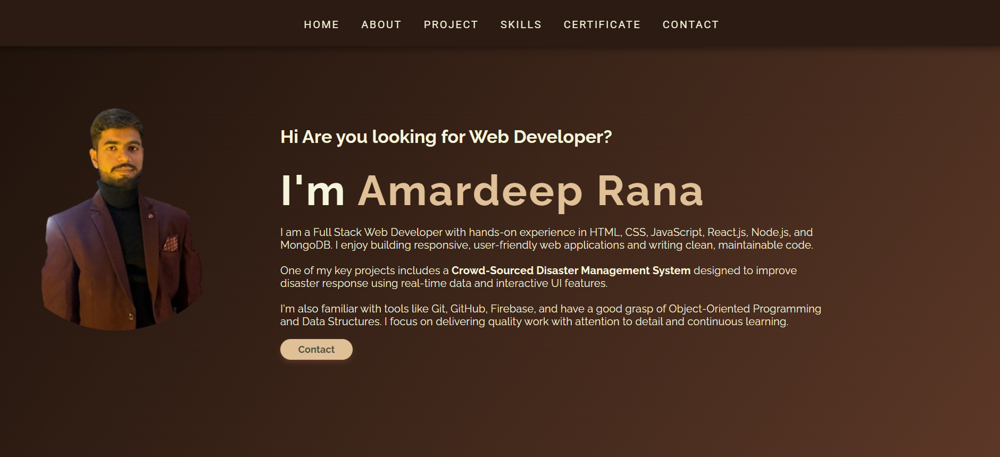

# 💼 Amardeep Rana - Portfolio Website

This is my personal **portfolio website** built using HTML5, CSS3, and JavaScript. It showcases my projects, skills, internship experience, certifications, and contact information.

## 🔗 Live Demo

[Click Here to View Portfolio](https://amardeeprana29.github.io/My-Portfolio/)

---

## 🚀 Features

- Responsive layout (Mobile + Desktop)
- Toggle navigation menu for mobile
- Hero section with image + intro
- About Me with resume download
- Project gallery with live demos
- Internship & Certification cards
- Skills categorized clearly
- Contact form with Formspree integration
- Social icons (GitHub, LinkedIn, LeetCode, Instagram)
- SEO optimized and fast loading

---

## 🛠️ Tech Stack

- **Frontend:** HTML5, CSS3, JavaScript  
- **Tools:** Git, GitHub, VS Code, Formspree  
- **Deployment:** GitHub Pages  
- **Design Theme:** Cocoa-Gold dark aesthetic  
- **Icons:** Font Awesome

---

## 📷 Preview

---

## 📩 Contact

If you'd like to collaborate or discuss a project, feel free to reach out:

📧 [amardeeprana2905@gmail.com](mailto:amardeeprana2905@gmail.com)  
🔗 [LinkedIn](https://www.linkedin.com/in/amardeeprana29/)  
🔗 [GitHub](https://github.com/Amardeeprana29)

---

## 📝 License

This project is open for educational and showcase purposes only.
